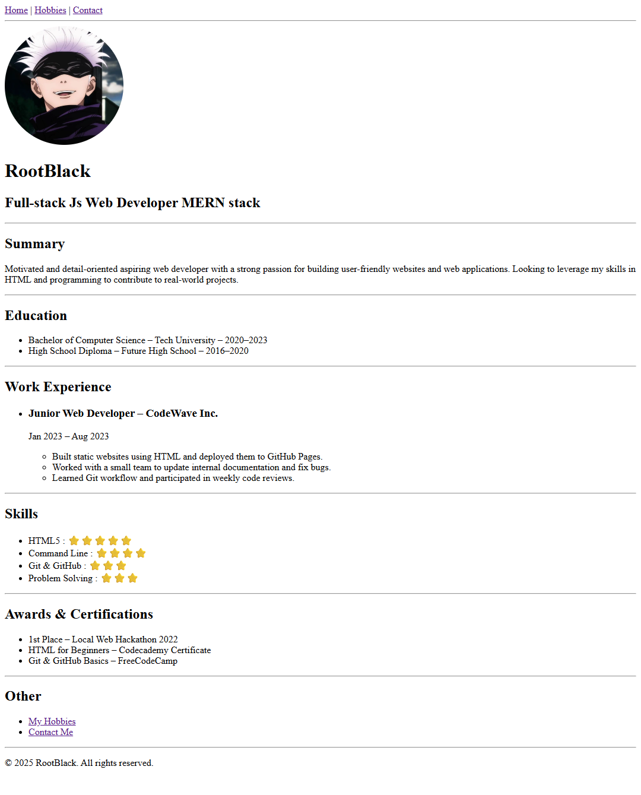

# Online Resume – Capstone Project 1

⚠️ **Disclaimer**: All content in this resume is fictional and created for learning/demo purposes only.  
Names, experiences, certifications, and contact details do **not** reflect real individuals.

---

This is my first Capstone Project from [The Complete Web Development Bootcamp](https://www.udemy.com/course/the-complete-web-development-bootcamp/).  
The project is built using **only HTML**, without any CSS or JavaScript, as required.

## 📄 Project Overview

This is a multi-page online resume, built with plain HTML, to practice semantic tags and structure:

- **Home (index.html)**: Contains summary, education, work experience, skills, and achievements.
- **Hobbies (hobbies.html)**: Personal interests and activities.
- **Contact (contact.html)**: Email and phone details (fictional).

## 🛠 Technologies Used

- HTML5 – Page structure and semantic content
- Git & GitHub – Version control and collaboration
- GitHub Pages – Hosting the resume online

## 🚀 Live Demo

[🔗 Click here to view the project online](https://rootblack04.github.io/Capstone-Project-1/)

## 📸 Preview



## 📁 Project Structure

```bash
CAPSTONE_PROJECT/
├── index.html
├── contact.html
├── hobbies.html
├── README.md
└── asset
    └── images
        ├── image.png
        └── screencapture.png
```

## ✨ Features

- Fully semantic HTML layout
- Multi-page navigation using anchor links
- Profile image (local placeholder)
- Clean separation of sections: summary, education, experience, etc.

## 📌 Future Improvements

- Add CSS for visual styling and layout
- Make pages responsive for mobile screens
- Add a Projects section and integrate GitHub repos

## 📚 Learning Goals Achieved

- Mastering basic HTML tags and structure
- Creating multiple pages with navigation
- Hosting a static site using GitHub Pages

## 📅 Date

July 2025 – Capstone Project 1 Submission

## © License

This project is for educational purposes only.  
© 2025 RootBlack. All rights reserved.
